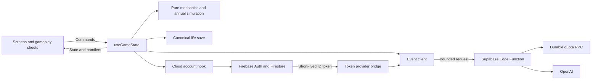

# SIMLYFE Architecture

> **Source of truth #1 of 3.** Runtime boundaries, data flow, identity, and persistence.
> Read alongside [game mechanics](./game-mechanics.md) and the [agent guide](./agent-guide.md).

SIMLYFE is a mobile-first browser life simulator. React owns the player interface, pure engine modules calculate outcomes, Firebase identifies players and stores lives, and a Supabase Edge Function generates events through OpenAI.

## Runtime boundaries



| Layer | Implementation | Responsibility |
|---|---|---|
| App | React 19, JSX, Vite 8 | Route between creation, gameplay, and death |
| Styling | [index.css](../src/index.css) | Pure CSS, custom properties, responsive layouts |
| State owner | [gameState.js](../src/engine/gameState.js) | React state, player commands, async transitions, persistence decisions |
| Mechanics | `src/engine/mechanics/` | Domain calculations and validation without React state |
| Annual simulation | `src/engine/annual/` | Compose one year's financial, relationship, and pet outcomes |
| Save contract | [lifeSave.js](../src/engine/lifeSave.js) | Defaults, persisted field names, complete save payloads |
| Cloud account | `src/engine/cloud/` | Auth bootstrap, account linking/switching, Firestore transport |
| Event client | [llmService.js](../src/engine/llmService.js) | Bounded request projection, authentication, deadlines, response validation |
| Event server | [generate-event](../supabase/functions/generate-event/index.ts) | Origin and identity checks, quota admission, provider request |
| Server contract | [contract.ts](../supabase/functions/generate-event/contract.ts) | Input schema, prompts, age guidance, model output contract |
| Content | `src/config/`, `src/engine/careers.json` | Activities, careers, assets, markets, cities, pets, and wealth tiers |

`useGameState()` remains the single owner of the life shown to the player. Extracted helpers return values; they do not call React setters, write saves, or generate network requests. Existing named exports from `gameState.js` remain available for callers during the refactor. New domain code should import the owning module directly.

## View routing

### Android shell

Capacitor 8 packages this same React application in `android/` with local assets
at `https://localhost`. `src/platform/nativeRuntime.js` installs Android Back;
`src/platform/useAndroidBack.js` lets MainGame consume it for nested menus/sheets
and frozen event/annual transitions. Unhandled root Back backgrounds the app.
The native shell never owns life state or replaces reset behavior.

`src/config/firebase.js` explicitly uses IndexedDB Auth persistence and a
persistent single-tab Firestore cache on Android. `src/platform/nativeGoogle.js`
obtains native Google credentials without a native Firebase session; the shared
account hook links or switches the existing JavaScript Auth user. Web popup
behavior remains in that same hook. Native configuration and rollout evidence
live in the [Android runbook](./android.md).

Release signing is a build-time boundary. Signing credentials are supplied by
the environment or an external private local configuration; they never enter
web assets, game state, or receipts. CI debug and release upload keys are separate.
Manual release builds produce signed artifacts without publishing them.

[App.jsx](../src/App.jsx) selects one of three routes:

1. No character and not dead: session splash, then `CharacterCreation`.
2. Dead: `DeathScreen`.
3. Living character: `MainGame`, plus `EventModal` when an event is open.

[MainGame.jsx](../src/components/MainGame.jsx) owns the active sheet, activity-menu selection, skill feedback, stats panel, and frozen-state visibility. [GameHeader.jsx](../src/components/game/GameHeader.jsx) renders the life summary and badges. [GameSheets.jsx](../src/components/game/GameSheets.jsx) binds engine commands to the gameplay panels.

Panels live under `src/components/sheets/`. [ActivitiesSheet.jsx](../src/components/sheets/ActivitiesSheet.jsx) routes activity special actions; [AssetsSheet.jsx](../src/components/sheets/AssetsSheet.jsx) retains asset navigation and delegates views to `sheets/assets/`. Components receive engine state and commands; they must not maintain a second copy of bank, career, education, or other life state.

## Life state and save contract

The current life is stored at `users/{uid}/saves/currentLife`. [lifeSave.js](../src/engine/lifeSave.js) owns `LIFE_SAVE_KEYS` and `buildLifeSave(fields)`:

```text
character, age, stats, bank, history, isDead, flags,
career, careerMeta, relationships, belongings, properties,
education, networking, economyCycle, pets, will
```

`buildLifeSave` emits every key, including intentional nulls and empty arrays. It supplies defaults; it is not a full validator or migration engine. [stateValidation.js](../src/engine/stateValidation.js) observes loaded saves and emits warnings containing field paths and codes. It does not reject, coerce, or migrate the document.

Transient state includes `currentEvent`, `isAging`, `activitiesThisYear`, `narrativeMode`, cloud connection status, account summary, and the loaded career catalog. These fields are not part of current life writes. The validation and Firestore allowlists also tolerate specific legacy fields; tolerating a field does not make it part of the current save contract.

One preserved hydration gap is explicit: `flags` is written in the save payload, but `hydrateFromSave` currently does not restore it. Treat correcting that behavior as a separate tested change rather than assuming the refactor fixed it.

### Cloud sync modes

| Operation | Write | Purpose |
|---|---|---|
| `startLife`, `resetLife` | `syncToCloud(fullSave, { replace: true })` | Replace the complete document at a life boundary |
| Mid-life mutation | `persistLife(overrides)` | Build a full current snapshot and merge it into the document |
| Account switch or sign-out | Clear local state, then load the selected account | Preserve the previous account's saved life |

`lifeSnapshotRef` tracks the current life on render and is updated eagerly by `persistLife`. React state updates have not necessarily flushed when a handler writes. Every field changed by that handler must therefore appear in its persistence overrides.

### Death restart flow

1. A death result sets `isDead: true` and persists the final life.
2. **Live Again** calls `resetLife()`.
3. Reset clears local state and replaces the cloud document with a blank `buildLifeSave` payload, including `career: null`, `pets: []`, and `isDead: false`.
4. `App` routes to character creation; `startLife` replaces the document again with the newborn life.

A page reload is not a reset: it can load the dead save again. `ignoreCloudLoadRef` protects a life started or reset while the initial cloud load is still pending from being overwritten by that late load.

While Firebase bootstrap is pending, the account hook queues the latest complete
save snapshot. A queued start/reset keeps replacement semantics even if later
actions update the snapshot. Once auth is ready, that snapshot is written to
the adopted UID. Explicit account switching/sign-out discards any queued boot
save so it cannot overwrite another account's life. The queue is in memory;
terminating the app before authentication finishes still cannot establish a
cloud save.

## Identity and account transitions

Firebase is loaded asynchronously after mount. Boot adopts an existing persisted session through `onAuthStateChanged`; it creates an anonymous session only when no account is present. The token-provider bridge in [firebaseToken.js](../src/engine/firebaseToken.js) supplies a short-lived Firebase ID token to the event client.

| Command | Behavior |
|---|---|
| Google sign-in | Link an anonymous account first, preserving its UID and save. If the credential belongs to an existing account, switch and load that account's save. |
| Email sign-up | Validate input, then link the anonymous account. An existing email returns a sanitized code so the UI can offer sign-in. |
| Email sign-in | Switch accounts, clear the local life, and load the signed-in account's save. |
| Password reset | Request a reset without revealing whether the account exists. |
| Sign-out | End the current session, start a fresh anonymous session, and clear local state without writing to the previous account. |

Account actions share the cloud transport rather than issuing Firebase calls from sheets. `authAccount` contains the UI's sanitized account summary, including provider, name, email, and photo; it is excluded from diagnostics.

### Security rules

[firestore.rules](../firestore.rules) allows an authenticated player to read and write only their own current-life document. Writes must use known top-level save fields. Authenticated players can read `careers`; only the Admin SDK seeds that catalog. Other client access is denied.

The rules constrain ownership and field names; they do not make browser-computed stats or money authoritative server calculations. [firestoreRules.test.js](../src/tests/firestoreRules.test.js) checks field-allowlist drift against the save contract. Rules deployment and service-account roles belong in the [operations runbook](./operations.md#firestore-rules).

App Check initialization is optional and controlled by [appCheck.js](../src/config/appCheck.js). Initializing the client is separate from registering a site and enabling enforcement in Firebase. See [operations](./operations.md#firebase).

## Annual transition and action locking

`ageUp` composes the annual calculation, commits the resulting state, checks death, then requests one event for a surviving life. The annual modules keep domain calculations separate from React setters and the asynchronous event request. The order of calculations matters: for example, tuition precedes income tax, while lifestyle costs use the balance after income.

While `isAging` is true or an event is open:

- Mutating commands return through the action lock, except `handleChoice`, which resolves the event.
- MainGame hides open sheets and disables action tabs, Age, and narrative-mode controls.
- The annual save contains the calculated fields explicitly, protecting them from a stale React closure after the request resolves.

The gameplay rules and timing belong in [game mechanics](./game-mechanics.md#core-loop). Extraction must preserve calculation order, random draws, event timing, and save boundaries unless a behavior change is explicitly included and tested.

The annual event request currently receives the pre-tick relationship and pet arrays, while most other request fields use the calculated next state. The saved life receives the updated arrays. This existing request timing is preserved by the extraction.

## Generated event contract

The browser sends only `{ state, actionContext, narrativeMode }` to the configured Supabase function. `state` is a bounded projection rather than the entire save. The Firebase token is the bearer credential; the Supabase public key is the separate `apikey` gateway header.

The server checks the exact request origin and the Firebase token's signature, issuer, audience, timestamps, and subject. It validates the request, admits it through durable per-identity and project-wide quotas, and calls OpenAI with a server-owned prompt, model, temperature, schema, and token ceiling. The default model is `gpt-4.1-nano`.

The provider's result is normalized to this browser envelope:

```json
{
  "event": {
    "description": "Event text",
    "choices": [
      { "text": "Choice label", "effects": { "health": 10, "bank": -50 } }
    ]
  },
  "meta": { "requestId": "request-id", "model": "model-name", "latencyMs": 1200 }
}
```

Both server and browser validate the event. Auth, network, timeout, quota, service, and validation failures produce sanitized error events. Static events remain a validated catalog; they are not a silent fallback for a failed AI request. The browser has no direct OpenAI path.

The client budget is 20 seconds across token acquisition and proxy fetch. The edge operation has a 15-second deadline, including an 8-second provider deadline. Calls do not retry automatically. [diagnostics.js](../src/engine/diagnostics.js) emits only allowlisted operational metadata and never whole saves, credentials, or raw provider errors.

Environment setup, quota configuration, and deployment verification are owned by [development](./development.md) and [operations](./operations.md), rather than duplicated here.
