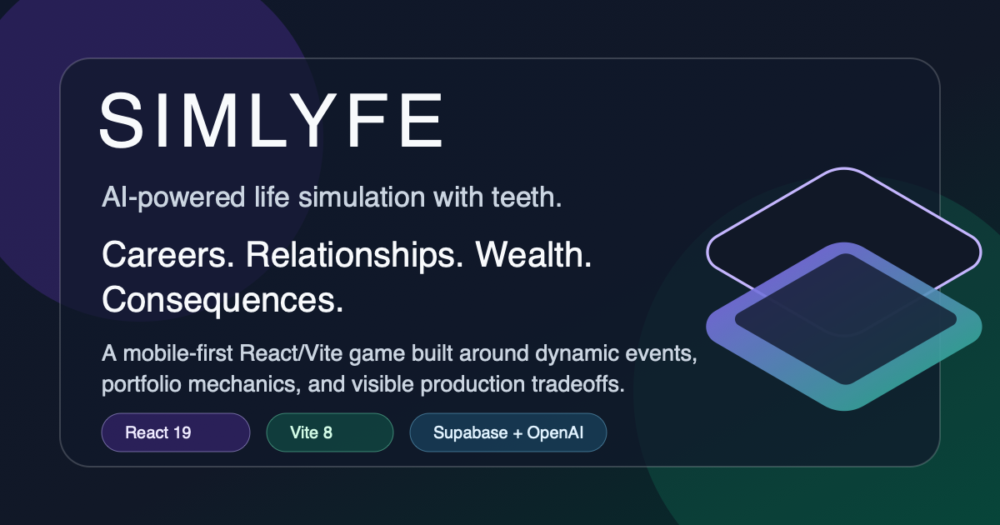
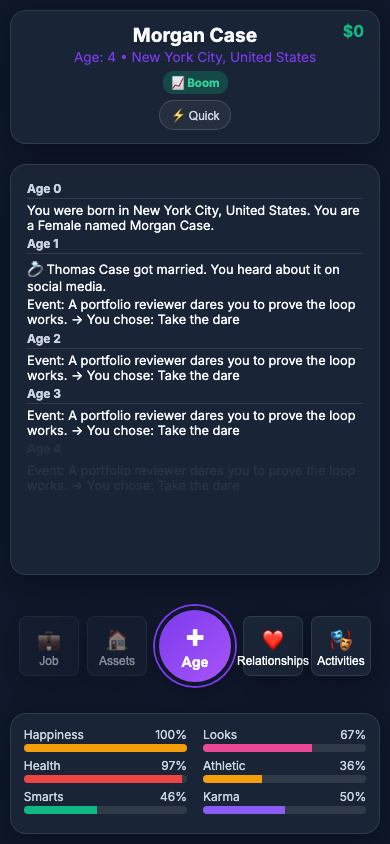
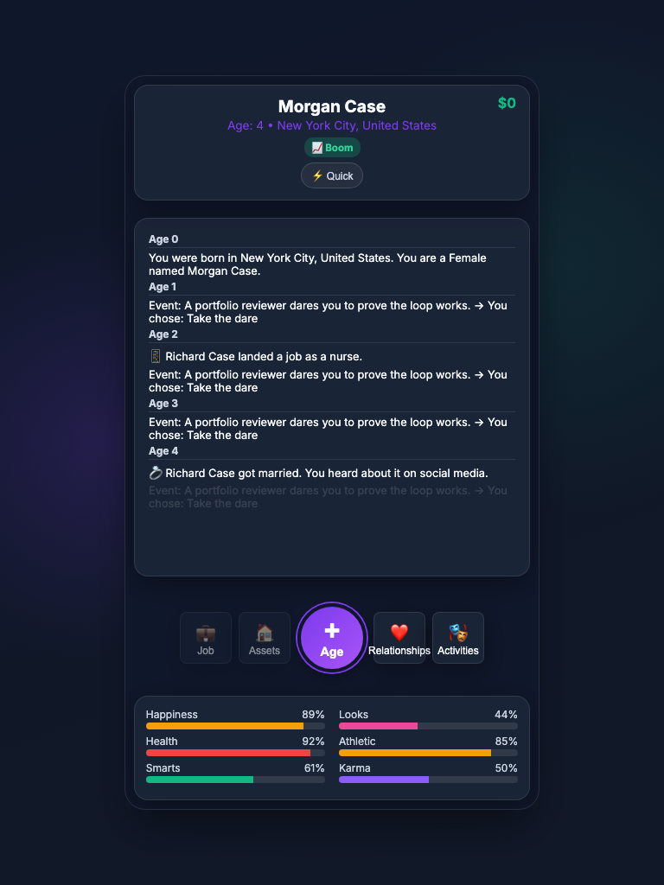
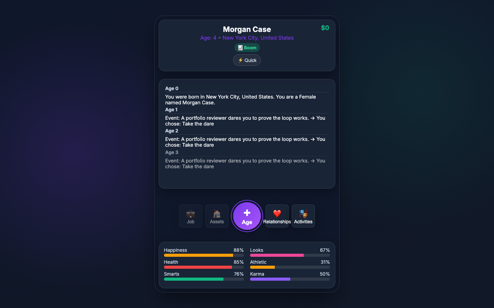
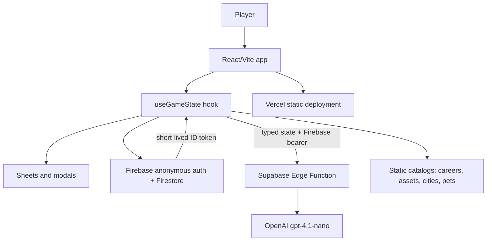

# SIMLYFE Technical Case Study

SIMLYFE is a mobile-first life simulation game built with React 19, Vite 8, pure CSS, Firebase, Supabase Edge Functions, and OpenAI. The goal is a playable portfolio project that shows product taste and engineering judgment: a fast browser game with visible systems, dynamic events, cloud-save support, and a production deployment story.

## Product Thesis

Most life simulators hide their systems behind scripted moments. SIMLYFE makes the systems legible: stats affect outcomes, wealth tiers change pressure, careers have promotion rules, relationships decay, assets appreciate or crash, and LLM events react to the player's current life.

The portfolio angle is not just "I made a game." It is "I shipped a coherent product surface, kept the core loop fast, and documented the tradeoffs behind AI, persistence, testing, and deployment."

## Screenshots

| Mobile | Tablet | Desktop |
|---|---|---|
|  |  |  |

## Architecture

All gameplay state stays in `useGameState()`. The UI is split into gameplay sheets so the core game screen stays readable while feature panels can evolve independently.

## Key Engineering Decisions

- **AI through a proxy:** production LLM events use a Supabase Edge Function so the OpenAI key is never bundled in client JavaScript.
- **Visible failure over fake success:** LLM failures surface as in-game error events. Static events remain validated content, but they no longer silently mask broken AI configuration.
- **Lazy cloud-save loading:** Firebase is dynamically imported only after the game mounts, reducing the initial bundle pressure for players who just want to start quickly.
- **Life-boundary cloud replace:** `startLife` / `resetLife` write a full Firestore document via `buildLifeSave` (no merge) so death restart and new lives cannot resurrect prior career, pets, or `isDead`. See [architecture.md](./architecture.md).
- **Plain CSS design system:** the project intentionally avoids Tailwind and UI libraries; the dark glass UI is built with CSS variables and small reusable patterns.
- **Deterministic quality gates:** Vitest covers core math/config behavior, and Playwright covers the first-run browser path.

## Production Audit Findings

- Live production is `simlyfe.vercel.app`, backed by Vercel project `xmike04s-projects/simlyfe`.
- The portfolio deployment was promoted from commit `4fbc4ca`; the combined security update must pass preview validation before it replaces that production deployment.
- Portfolio hardening removed a stale tracked worktree gitlink, excluded generated output from lint, and added the previously missing social image.
- The Vercel project did not yet contain Firebase browser configuration during the audit, so authenticated AI events and cloud saves require an environment rollout before production promotion.

## Reliability and Security

- The browser has no direct OpenAI path. It sends a Firebase ID token plus a Supabase public gateway key to one proxy endpoint.
- The edge function verifies exact origins and Firebase signatures, accepts only a bounded typed state projection, and owns the prompt, model, temperature, strict output schema, and token ceiling.
- Durable per-identity and project-wide quotas, body/operation deadlines, cancellation, and no-retry behavior bound cost amplification.
- Both edge and browser validate the normalized event envelope; diagnostics and player-facing errors discard raw provider, credential, prompt, and player-state details.
- Debug tooling is gated behind `VITE_ENABLE_DEV_TOOLS`; it is off by default for portfolio and production demos.
- `.vercel/`, `.env.local`, generated worktrees, and service-account files stay out of Git.

## Validation Plan

Portfolio-ready means these gates pass before production promotion:

- `npm run lint`
- `npm test`
- `npm run build`
- `npm run test:e2e`
- browser QA at mobile, tablet, and desktop widths
- Vercel preview inspection before production deployment

## Next Improvements

- Add lightweight client-side analytics for funnel events such as start life, first age-up, first event choice, and death screen.
- Add an error-reporting integration for client-side runtime exceptions.
- Extract more pure game mechanics from `gameState.js` to reduce test mirror drift.
- Add a save reset/export flow so demos can restart without relying on browser storage or Firebase state.
