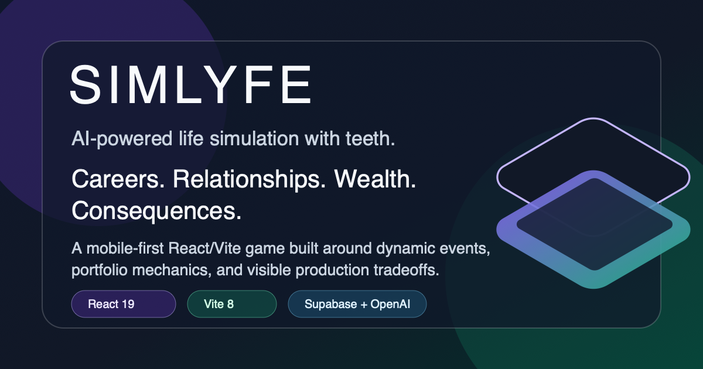
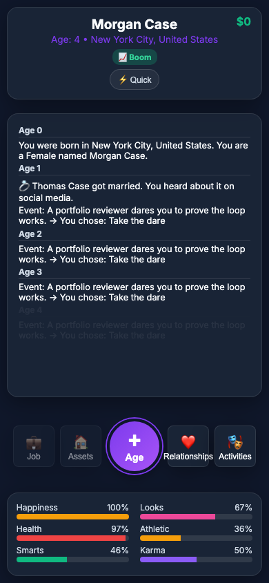
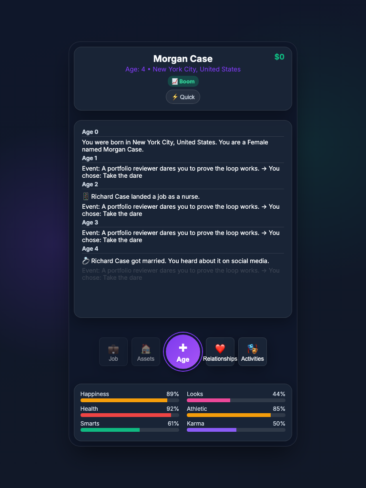
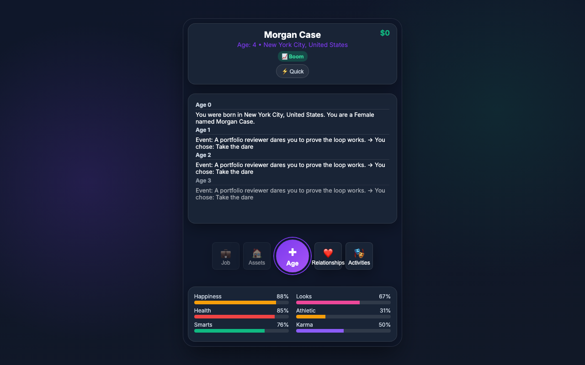

# SIMLYFE Technical Case Study

SIMLYFE is a mobile-first life simulation game built with React 19, Vite 8, pure CSS, Firebase, Supabase Edge Functions, and OpenAI. It demonstrates a complete product loop: player actions drive explicit state changes, generated events react to a bounded life snapshot, and authenticated cloud saves preserve progress.

**[Play the live app](https://simlyfe.vercel.app)** · [Architecture](./architecture.md) · [Refactor scope and evidence](./refactor-plan.md)

## Product scope

Players advance a life through education, work, relationships, health, and finances. Stats and catalog rules influence outcomes: careers have eligibility and promotion requirements, wealth tiers change tax and lifestyle pressure, relationships decay when ignored, and assets can appreciate or crash. The interface presents those systems through a compact main screen and focused gameplay sheets.

Generated narrative adds variation while the browser engine applies the resulting effects. This creates two separate quality problems: the calculations must be repeatable under test, and the generated situations must be plausible and interesting during play.

## Screenshots

The committed screenshots illustrate the product surface; they are not evidence of a particular backend deployment or the latest source revision.

| Mobile | Tablet | Desktop |
|---|---|---|
|  |  |  |

## Engineering decisions

### One state owner with testable calculations

`useGameState` owns React life state, player commands, event timing, and persistence. The refactor separates pure mechanics and the annual simulation from that hook. A complete annual calculation can run without React, Firebase, or a model call, with controlled randomness for repeatable tests.

The extraction preserves existing caller exports and the current save contract. The goal is to make a rule such as tuition, a bond maturity, or relationship decay easy to find and test without changing the observable game during the move. Details and validation receipts live in the [refactor ledger](./refactor-plan.md).

### Account identity and life identity are separate

A guest receives a Firebase anonymous identity. Linking Google or email credentials can preserve that UID and its save; signing into an existing account instead loads the save belonging to that account.

Starting or resetting a life replaces the complete Firestore document. Mid-life actions write a complete current snapshot with explicit just-mutated fields. This distinction prevents prior career, pets, or death state from surviving a new-life boundary, and avoids relying on React setters having already flushed.

### AI is a bounded external dependency

The browser sends a Firebase bearer token and a public Supabase gateway key to one event endpoint. The edge function verifies identity and exact origins, validates a bounded request, applies durable quotas, and owns the provider prompt, model, output schema, and token budget.

Server and client both validate the normalized event response. Operational deadlines and no automatic retries bound request amplification. Failures become visible in-game error events instead of silently replacing the AI path with static content. Redacted diagnostics describe operations without logging full lives or credentials.

### Interface boundaries match player tasks

The main screen handles navigation, summary information, and action locking. Dedicated sheets own activity menus, account controls, relationships, and assets. The asset panel delegates its overview, portfolio, shopping, and investment views to smaller components while keeping navigation state in one place.

Pure CSS and existing component patterns retain the project's mobile-first visual design. The refactor does not require a new UI framework or a redesign.

## Verified production milestone

On **September 15, 2026**, before this refactor, the connection rollout verified [simlyfe.vercel.app](https://simlyfe.vercel.app) at source commit `a49a1ca` with real anonymous authentication, a generated event, and Firestore save/reload. Firebase Google and email/password providers were enabled, and the authenticated Supabase proxy and durable quota migration were deployed.

That baseline passed lint, 1,337 Vitest tests across 19 files, a production build, and one Playwright flow. The served public JavaScript was compared with the tested deployment output. The [operations record](./operations.md#recorded-production-baseline) holds the deployment context and limits.

These are dated baseline results. They do not claim that the refactor has been deployed or that every sign-in provider has been exercised end to end. Refactor-specific checks and deployment state belong in its [validation ledger](./refactor-plan.md).

## Tradeoffs and remaining boundaries

- A browser-owned simulator gives immediate interactions and straightforward local testing, but Firestore ownership rules do not make client-computed money or stats tamper-proof.
- Anonymous identity makes the first session simple; an account upgrade is needed for a more durable, portable player identity.
- Structured output validates shape and bounded effects. Narrative quality, age plausibility, and repetition still require actual playtesting.
- App Check client support exists, but enforcement was not enabled in the recorded production baseline.
- Mocked browser checks establish application wiring. Live account, save, and provider behavior need deployment-specific verification.
- Compatibility can preserve imperfect legacy behavior. The [mechanics reference](./game-mechanics.md) records those behaviors explicitly so a later product change can address them with dedicated tests.

The documentation follows the same separation as the implementation: architecture explains boundaries, mechanics describes rules, development explains checks, and operations records how to prove a deployment works.
